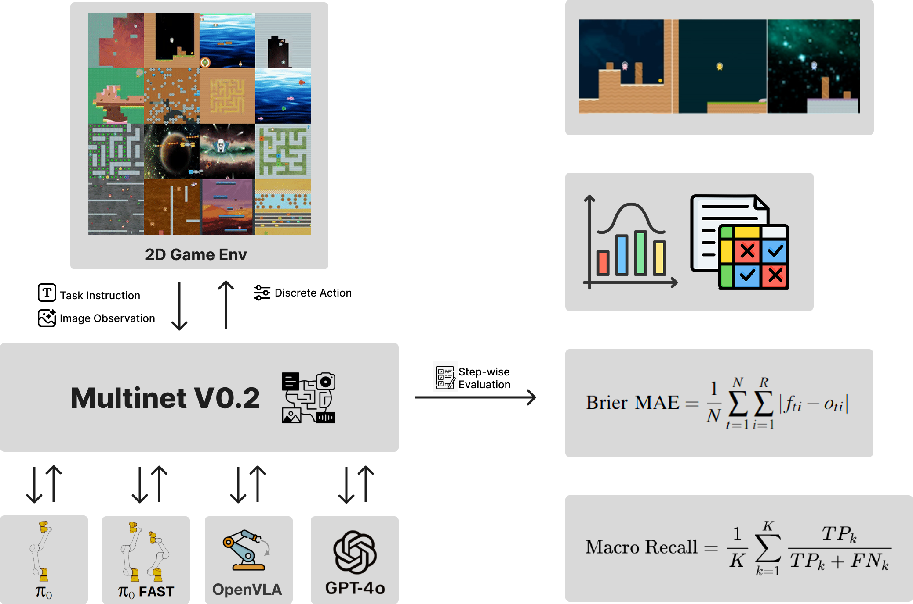

<p align="center">
  
  <h1 align="center" style="display: inline-block; vertical-align: middle; margin-left: 20px;">MultiNet: A Generalist Benchmark for Multimodal Action models</h1>
</p>

<p align="center">
  [](https://multinet.ai/) 
  [](https://arxiv.org/abs/2505.05540) 
  [](https://multinet.ai/static/pdfs/MultiNet_Dataset_Spec_Paper.pdf) 
  [](https://github.com/ManifoldRG/MultiNet/tree/main/src/modules) 
  [](https://discord.gg/Rk4gAq5aYr)
</p>

### This work is sponsored by, and is being done in close collaboration with [Metarch](https://metarch.ai/).

## 📢 Updates

- 🏆 2025-05-22: Multinet v0.2 - We systematically profile state-of-the-art VLAs and VLMs to understand how they perform in procedurally generated OOD game environments! Read more about our recent release [here](https://multinet.ai/static/pages/Multinetv02.html)
- 🎉 2024-11-08: We release the first version of MultiNet where we profiled SoTA VLMs and VLAs on real-world robotics tasks - Multinet v0.1! Check our [release page](https://multinet.ai/static/pages/Multinetv01.html) for more details.
- 🚀 2024-03-22: Introducing Multinet! A new generalist benchmark to evaluate Vision-Language & Action models. Learn more [here](https://multinet.ai)

## 🔍 Overview

This repo provides the following:
1. Ability to download any or all datasets of what aims to be the largest consolidation of open-source vision-language + control/action (RL, Robotics) data
2. Ability to translate control data of various formats and from various sources to a unified [Tensorflow Dataset format](https://www.tensorflow.org/datasets/api_docs/python/tfds). 
3. Evaluate the performance of SoTA VLMs and VLAs such as GPT-4.1, GPT 4o, Pi0, Pi0 with FAST, and OpenVLA in a zero-shot setting on a wide-variety of action data such as [robotics](https://multinet.ai/static/pages/Multinetv01.html) and [procedurally generated game-play](https://multinet.ai/static/pages/Multinetv02.html).
4. A [general framework](https://github.com/ManifoldRG/MultiNet/tree/main/src/modules) for mapping VLMs to other modality classes, with particular emphasis on action spaces. This framework allows one to adapt a wide range of models to multiple types of tasks or datasets for scaling effectively while reducing the amount of engineering effort required.  In MultiNet v0.1, GenESIS is used to evaluate GPT 4o on the OpenX datasets, and in Multinet v0.2 GenESIS is used to evaluate GPT 4o and GPT 4.1 on the Procgen dataset.
5. Test splits of Multinet datasets and clear guidelines required to evaluate your model on them, and the results to our leaderboard in order to compare performance against SoTA VLMs and VLAs.

Also related to the MultiNet effort is [μGATO](https://github.com/eihli/mugato), a small, simple, open-source implementation of what is described in DeepMind's GATO paper. This project marks our initial step towards building a multimodal generalist action model.

<br>

<p align="center">
  
</p>

<br>

<p align="center">
  
</p>

## 🚀 Getting Started

#### To set up the environment for download, translation, and evaluation of GPT-4o and HuggingFace's JAT:

```bash
conda create -n multinet python=3.10
conda activate multinet
git clone https://github.com/ManifoldRG/MultiNet.git
cd MultiNet/src
pip install -r requirements.txt
```

#### To download the datasets in v0:

```bash
cd Multinet/src
python centralized_downloader --dataset_name <name of dataset you would like to download> --output_dir <directory where you would like to download the dataset>
```

#### To translate one file/shard of your desired control dataset (downloaded using the downloader script in this repo) to the TFDS format 

```bash
cd Multinet/src/control_translation
python centralized_translation --dataset_name <name of dataset whose file you would like to translate> --dataset_path <path to the downloaded dataset> --output_dir <directory where you would like to store the translated file>
```

#### To translate multiple files/shards of your desired control dataset (downloaded using the downloader script in this repo) to the TFDS format 

Make sure to modify the way the multiple files are being traversed for translation in translate_multiple.py in Multinet/src/control_translation according to your local file structure.

```bash
cd Multinet/src/control_translation
python wrapper_translate_multiple.py --dataset_name <name of dataset whose file you would like to translate> --dataset_path <path to the downloaded dataset> --output_dir <directory where you would like to store the translated files>
```

#### To evaluate GPT 4o and 4.1 (in a zero-shot setting) using the [GenESIS framework](https://github.com/ManifoldRG/MultiNet/tree/main/src/modules) 

To get the predictions:

```bash
cd Multinet/scripts/eval_vlm
python send_batch_jobs_vlm.py --data_root_dir < path to the translated datasets > --dataset_family < dataset name > --model < gpt model name and version ( see "models" section in config.json: https://github.com/ManifoldRG/MultiNet/blob/v02_release_updates/src/config.json ) > --metadata_dir < path to save batch info > --batch_size < batch size >
```

Enter the OpenAI API key when prompted.

To evaluate the predictions:

```bash
python run_eval_vlm.py --batch_job_info_path "< path where batch info is saved from prev step >/< dataset name >_batchlist{timestamp}.json" --results_path "< path to store results >.json"
```

#### To evaluate OpenVLA (in a zero-shot setting)

We set up our conda environment and ran evaluations for OpenVLA on a GCP Instance with 1 L4 GPU, driver version 550.90.07, and CUDA version 12.4. For more details about the infrastructure used, refer to our [paper](https://multinet.ai/static/pdfs/Benchmarking%20Vision%20Language%20Action%20Models.pdf). If you are using our code out-of-the-box, we recommend using the same infrastructure.

For setup, create a new conda environment and run the OpenVLA environment setup bash script (this will download both the OpenVLA requirements as well as the broader MultiNet requirements):

```bash
cd Multinet/src
./openvla_multinet_setup.sh
```

To run evaluations:

Before running evaluations, make sure you have the correct path for the dataset statistics json files (similar to those present in )

```bash
cd Multinet
python src/eval/profiling/openvla/experiments/robot/openvla_profiling.py --profiling_dataset_folder_path <path to the translated datasets> --dataset_statistics_path < path to dataset statistics json file > --result_save_path < path to the directory where you would like to save your results >
```

#### To evaluate Pi0 Base (in a zero-shot setting)

We set up our conda environment and ran evaluations for Pi0 Base and Pi0 with FAST on GCP Instances with A100 40 GB VRAM GPUs. If you are using our code out-of-the-box, we recommend using the same infrastructure.

For setup, create a new conda environment and download the packages present in src/eval/profiling/openpi/pyproject.toml. [Install uv](https://docs.astral.sh/uv/getting-started/installation/) before running the following commands:

```bash
cd Multinet/src/eval/profiling/openpi
GIT_LFS_SKIP_SMUDGE=1 uv sync
GIT_LFS_SKIP_SMUDGE=1 uv pip install -e .
```

Before running evaluations, make sure you have the correct path for the dataset statistics json files (similar to those present in )

To run evaluations for Pi0 Base on Procgen:

Modify the path to the dataset statistics json in the inference script based on the correct path [here](https://github.com/ManifoldRG/MultiNet/blob/282e6c9c7b588f98b2f04e685974eb2d45f59766/src/eval/profiling/openpi/scripts/procgen_inference.py#L412)

```bash
cd Multinet/src/eval/profiling/openpi
python procgen_inference.py --output_dir < path to the directory where you would like to save your results  > --dataset_dir < path to the root directory containing the different subdatasets of Procgen > --batch_size < batch size > 
```

To run evaluations for Pi0 with FAST on Procgen

```bash
cd Multinet/src/eval/profiling/openpi
python procgen_inference_fast.py --output_dir < path to the directory where you would like to save your results  > --dataset_dir < path to the root directory containing the different subdatasets of Procgen > --dataset_stats_dir < path to dataset statistics json file > --batch_size < batch size > 
```

#### To evaluate JAT (in a zero-shot setting) on the 53 OpenX Embodiment datasets it was profiled on as a part of Multinet v0.1 

Make sure to set the path to the translated openx datasets you want to evaluate on and the path where you want to dump your results in Multinet/src/eval/profiling/jat/scripts/profile_openx.py

```bash
cd Multinet/src/eval/profiling/jat/scripts
python profile_openx.py
```

## 📊 Evaluation and submission process to the Multinet benchmark

Here are steps to follow to evaluate your team's model on Multinet data and submit results to our benchmark:

*   Download the desired dataset using the download+translate SDK that we provide by following the steps mentioned above.
*   Open an issue on our Github with the tag `evaluate`. The issue title should be: "Add < your model name > to Multinet benchmark". 
*  You can access the list of test episodes for a specific dataset at [src/eval/profiling/test_data](src/eval/profiling/test_data). These test episodes can then be translated from the downloaded data using the download+translate SDK by following the steps mentioned above.
*   We break down the required components to run evals using a model into 3 categories:
    *   **Ingestion pipeline**: Pipeline to feed the model with the test data with necessary input processing. This can be similar to the dataloaders we have implemented in [src/data_utils](src/data_utils)
    *   **Model adaptation**: Adapt your model to ingest the test data and produce actions in the appropriate format. This can be similar to how we have implemented model adaptations for various models such as [Genesis for VLMs](src/modules/), and custom adaptations for VLAs such as [OpenVLA](https://github.com/ManifoldRG/MultiNet/blob/main/src/eval/profiling/openvla/experiments/robot/openvla_profiling.py), [Pi0 Base](https://github.com/ManifoldRG/MultiNet/blob/main/src/eval/profiling/openpi/scripts/procgen_inference.py), and [Pi0 FAST](https://github.com/ManifoldRG/MultiNet/blob/main/src/eval/profiling/openpi/scripts/procgen_inference_fast.py)
    *   **Inference pipeline**: The inference pipeline should include a `predict_action` function that takes in the observations of a timestep/batch of timesteps as input, produces the action(s) for a given timestep/batch of timesteps, and processes it to ensure the outputs are in the appropriate format.
        *   **You must implement deterministic inference by setting explicit seed values for all stochastic operations within the model inference pipeline. This requirement applies to any component that introduces non-determinism during the inference process.**
*   You can then run inference on the test data to obtain zero-shot predictions for all the timesteps.
    *   Once all the predictions are obtained, they can be evaluated using the metrics we implement and report. You can find the helper functions that implement all the metrics in [src/eval_utils.py](src/eval_utils.py)
    *   The results should consist of a JSON file for each subdataset of the test dataset where the keys are the names of the metrics and the values are metric values. These JSON files should also contain the predictions of the model. You can use the results files in [src/v02_results/](src/v0_2results/) as reference.
*  Once the results are ready, you should open a PR that contains the code that can produce the results you report, and the final results in the correct format. Make sure to provide all necessary details for reproducibility - especially the seed values used in the inference pipeline. Associate this PR with the Issue opened in the second step mentioned above.
*   Upon review by our team, we will either merge the PR or request changes/modifications/clarifications.
    *   Once further queries are resolved, the PR will be merged and Issue closed.
*   Once the PR is merged and results are accepted, we will display the results on our [website](https://multinet.ai/)!


## 📜 Citation

If you use MultiNet in your research, please cite our work:

```bibtex

Multinet v0.2 - Benchmarking Vision, Language, & Action Models in Procedurally Generated, Open Ended Action Environments

@misc{guruprasad2025benchmarkingvisionlanguage,
      title={Benchmarking Vision, Language, & Action Models in Procedurally Generated, Open Ended Action Environments}, 
      author={Pranav Guruprasad and Yangyue Wang and Sudipta Chowdhury and Harshvardhan Sikka},
      year={2025},
      eprint={2505.05540},
      archivePrefix={arXiv},
      primaryClass={cs.CV},
      url={https://arxiv.org/abs/2505.05540}, 
      }

Multinet v0.1 - Benchmarking Vision, Language, & Action Models on Robotic Learning Tasks

@misc{guruprasad2024benchmarkingvisionlanguage,
      title={Benchmarking Vision, Language, & Action Models on Robotic Learning Tasks}, 
      author={Pranav Guruprasad and Harshvardhan Sikka and Jaewoo Song and Yangyue Wang and Paul Pu Liang},
      year={2024},
      eprint={2411.05821},
      archivePrefix={arXiv},
      primaryClass={cs.RO},
      url={https://arxiv.org/abs/2411.05821},
      }

Multinet Vision and Dataset specification

@misc{guruprasad2024benchmarking,
      author={Guruprasad, Pranav and Sikka, Harshvardhan and Song, Jaewoo and Wang, Yangyue and Liang, Paul},
      title={Benchmarking Vision, Language, & Action Models on Robotic Learning Tasks},
      DOI={10.20944/preprints202411.0494.v1},
      year={2024},
      }    

```


