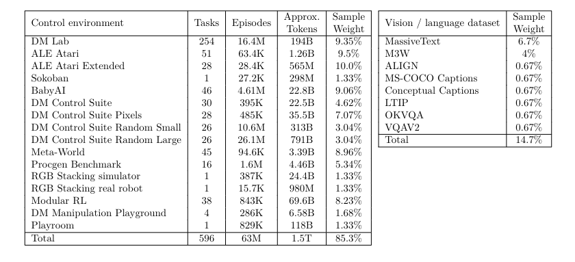

# MultiNet

This repo contains simple code that can be used to **download** one of the largest open-source vision-language + control (RL, Robotics) datasets, and **translate** control data of various tasks and sources to a unified [Tensorflow Dataset format](https://www.tensorflow.org/datasets/api_docs/python/tfds). 

We are currently working towards a new Multimodal Generalist Benchmark to evaluate the generalist capabilities of Vision-Language-Action (VLAs) style models. 

The first version of this project will result in the creation of the pretraining corpus for the [NEKO](https://github.com/ManifoldRG/Neko) project, as well as the evaluation set for the new benchmark.

Inspired by the emerging class of VLAs, we at [Manifold Research Group](https://discord.gg/8YenUd5y) believe that training a large model on web-scale multimodal data, and reward-based action trajectories in the form of Reinforcement Learning and Robotics data, will result in a new class of foundation models that are truly generalist and can autonomously plan, interact with their environments, and complete actions in an agentic manner.

The pretraining corpus of one such model - Deepmind's GATO:



However, many datasets in the above list are closed-source. With MultiNet, we provide several trillion tokens worth of open-source VLA data. Below is the final list of datasets included in MultiNet v0. Links to the datasets can be found in [Issue #19](https://github.com/ManifoldRG/MultiNet/issues/19):

| Vision/language datasets| 
| ----------------------- | 
| OBELICS                 | 
| COYO-700M               | 
| MS COCO                 | 
| Conceptual Captions     | 
| A-OKVQA                 | 
| VQA-v2                  | 
| Datacomp 1B             | 
| FineWeb Edu             | 

| RL + Robotics datasets    | 
| ------------------------- | 
| DM Lab                    |
| ALE Atari                 |
| BabyAI                    |
| MuJoCo                    |
| DM Control Suite          |
| V-D4RL                    |
| Meta-World                |
| Procgen                   |
| Language Table            |
| Open-X Embodiment dataset |
| LocoMuJoCo                | 


We’re always looking forward to quick and longer term collaborators getting involved. So, if you are interested in contributing please take a look at our [open issues](https://github.com/ManifoldRG/MultiNet/issues) or reach out to us via [Discord](https://discord.gg/Tad7wAX8)

## Getting Started

To set up the environment

```bash
conda create -n multinet python=3.10
conda activate multinet
git clone https://github.com/ManifoldRG/MultiNet.git
cd MultiNet/src
pip install -r requirements.txt
```

To download the datasets in v0

```bash
cd Multinet/src
python centralized_downloader --dataset_name <name of dataset you would like to download> --output_dir <directory where you would like to download the dataset>
```

To translate one file of your desired control dataset to the TFDS format downloaded using the downloader script in this repo

```bash
cd Multinet/src/control_translation
python centralized_translation --dataset_name <name of dataset whose file you would like to translate> --dataset_path <path to the dataset> --output_dir <directory where you would like to store the translated file>
```

To limit schema to (observations, actions, rewards) while translating

```bash
cd Multinet/src/control_translation
python centralized_translation --dataset_name <name of dataset whose file you would like to translate> --dataset_path <path to the dataset> --output_dir <directory where you would like to store the translated file> --limit_schema True
```


