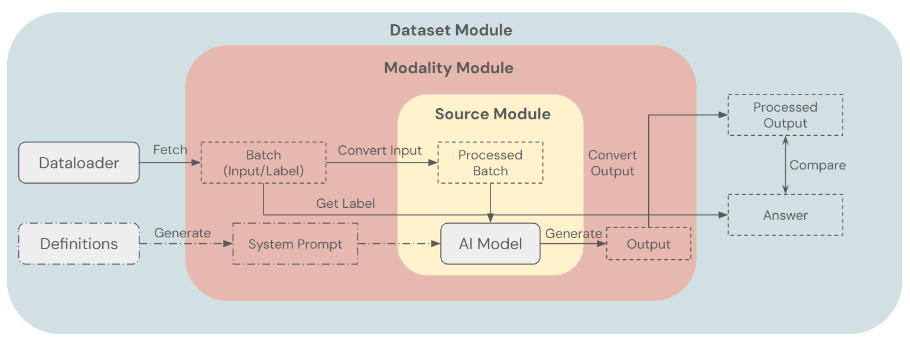

# GenESIS: Generalizable Extendable Stratified Inference System

<p align="center">
  <a href="https://multinet.ai/"></a> 
  <a href="https://arxiv.org/abs/2505.05540"></a> 
  <a href="https://arxiv.org/abs/2411.05821"></a> 
  <a href="https://multinet.ai/static/pdfs/MultiNet_Dataset_Spec_Paper.pdf"></a> 
  <a href="https://github.com/ManifoldRG/MultiNet/tree/main/src/modules"></a> 
  <a href="https://discord.gg/Rk4gAq5aYr"></a>
</p>

The MultiNet project is built upon GenESIS (Generalizable and Extendable Stratified Inference System), a modular framework made to streamline the integration of diverse AI models across a multitude of tasks and datasets. It allows new models and datasets to be added to the MultiNet benchmark efficiently and without disrupting existing components. At its core, GenESIS aims to maximize scalability and engineering efficiency through the following principles:
* <u>Interchangeability</u>: Models and datasets are designed to be mutually supportive and easily swappable.
* <u>Abstraction</u>: Common architectural patterns and logic are shared across modules, simplifying development, understanding, and testing. This is significantly advanced by the use of base module classes.
* <u>Encapsulation</u>: Developers can concentrate on their specific model or dataset without requiring deep knowledge of unrelated modules.

The latest version of GenESIS features base module classes, which improves maintainability and reduces the overhead engineering time needed to evaluate future dataset additions. It also adds batch inference capability, which reduces chance of process failure during evaluation, and vastly increases evaluation speed.



<br/>

## Mapping LLMs to Robot Actions in MultiNet

For example, GenESIS is used to evaluate models like GPT-4o on datasets such as OpenX and Procgen. For general-purpose Vision-Language Models (VLMs), this involves setting up appropriate instruction prompts, preprocessing input data from various datasets into a consumable format, managing API interactions (including chat history for synchronous calls or batch job submissions for asynchronous ones), and converting model outputs back into a format suitable for evaluation against task-specific labels. GenESIS modularizes and abstracts these processes, separating dataset/model-specific logic and maximizing code reusability. This approach is crucial for scaling the MultiNet benchmark system. Many models accessible via OpenAI API, for instance, can be run on OpenX and Procgen datasets using GenESIS.

<br/>

---

## Modules

GenESIS consists of three hierarchical components called "modules". As we move from upper to lower modules, features become more general and shared. The architectural foundation now includes base classes for dataset modules, streamlining the addition of new datasets and evaluation strategies.

1.  **Dataset Module**: This parent module utilizes modality and source modules. It encapsulates dataset-specific features and all logic for a particular dataset or task.
    * **Responsibilities (not limited to):**
        * Loading data (e.g., via a dataloader object) and fetching batches of inputs and labels.
        * Generating system instruction prompts for LLM/VLM modules based on dataset-specific definitions.
        * Comparing model outputs with labels to calculate evaluation metrics.
    * **Base Architecture:**
        * `BaseDatasetModule` (`src/modules/dataset_modules/base_dataset_module.py`) provides a common structure. Concrete dataset modules inherit from it.
        * Two primary evaluation patterns are supported:
            1.  **Streaming Evaluation (`DatasetModule` pattern):** For iterative processing of data. The module's `run_eval` method typically loops through data, calling `infer_step` on the modality module for each step.
            2.  **Asynchronous Batch Evaluation (`DatasetBatchModule` pattern):** For leveraging batch processing APIs (e.g., OpenAI Batch API). This involves methods like `send_batch_jobs_for_all_datasets` to submit tasks and a `run_eval` that later collects results from these jobs using stored `BatchInfo`.
    * **Examples:**
        * `OpenXModule` (`src/modules/dataset_modules/openx_module.py`): Handles OpenX datasets, using OpenXDataloader, calculating MSE and success rates. It implements both streaming evaluation (as `OpenXModule`) and batch API-based evaluation (as `OpenXBatchModule`).
        * `ProcgenModule` (`src/modules/dataset_modules/procgen_module.py`): Manages Procgen environments, supporting discrete action spaces and calculating metrics like Brier scores and F1-scores. It also implements both streaming (`ProcGenModule`) and batch (`ProcGenBatchModule`) patterns.

2.  **Source Module**: Contains the actual AI model or API client to generate outputs.
    * **Responsibilities (not limited to):**
        * Executing the inference step to generate model output.
        * Managing multi-turn context (updating context memory, ensuring inputs fit within model context window).
        * Employing tokenizers/encoders to prepare inputs for the model.
    * **Example:**
        * `OpenAIModule` (`src/modules/source_modules/openai_module.py`): Uses OpenAI's Python client.
            * Supports synchronous inference via `infer_step`.
            * Offers direct batch inference using OpenAI's Batch API via `batch_infer_step` and helper methods like `_execute_batch_job`, `get_batch_job_status`, and `retrieve_batch_results`.
            * Manages concurrent prompt histories (via an `idx` parameter in methods like `add_data`) to support batch operations efficiently.
            * Includes mechanisms for token calculation (text and image) and context truncation.
            * Tracks token usage against daily limits for batch queue operations.

3.  **Modality Module**: Connects dataset and source modules, handling data conversion across modalities (images, texts, arrays, etc.).
    * **Responsibilities (not limited to):**
        * Converting data from the dataset module into types the source module can handle, tagging data for clarity.
        * Converting model output from the source module back to its original type for evaluation by the dataset module.
    * **Example:**
        * `VLMModule` (`src/modules/modality_modules/vlm_module.py`): Processes image and text data. For other data types, it typically converts them to strings. It supports:
            * Synchronous inference via `infer_step`.
            * Asynchronous batch job management by wrapping source module capabilities, offering methods like `send_batch_job` (to submit a job and get a `batch_job_id`), `get_batch_job_status`, and `retrieve_batch_results`. These are used by `DatasetBatchModule` implementations.

<br>

---

## Definitions

These are the main variables and functions that each module type should support for GenESIS to work effectively. Note that these represent core interfaces; specific implementations might add further helper functions or variables. The introduction of base dataset modules has standardized many of these requirements.

($B$: Batch size, $K$: # of few-shot examples, $N$: # of data elements constituting one input)

1.  **Dataset Module**
    The `base_dataset_module.py` file defines common interfaces.
    * **Shared Properties/Methods (often in `BaseDatasetModule`):**
        * `self.modality_module (Object)`: The modality module object.
        * `self.batch_size (int)`: Batch size for dataloaders.
        * `self.k_shots (int)`: Number of few-shot examples.
        * `self.action_stats (dict)`: Statistics of the action space.
        * `self._definitions_class`: Class providing dataset-specific definitions (descriptions, action spaces).
        * `self.get_dataloader_fn`: Function to get the dataset-specific dataloader.
        * `self.format_instruction_prompt_fn`: Function to format instruction prompts.
        * `_find_shards(self, dataset_name: str) -> list[str]`: Finds data shards. (Abstract in base, implemented in concrete class)
        * `_get_vlm_instruction(self, dataset_name: str, env_name: str) -> str`: Generates system prompts.
        * `_get_output_type(self, dataset_name: str, env_name: str) -> type`: Determines expected model output type.

    * **For Streaming Evaluation (e.g., inheriting `DatasetModule`):**
        * Required functions:
            * ```python
                def __init__(self, disk_root_dir: str, modality: str, source: str, model: str, batch_size: int, k_shots: int) -> None
                ```
                  (Handled by `BaseDatasetModule` and then specialized)
            * ```python
                def run_eval(self) -> None
                ```
                  (A template is in `BaseDatasetModule`; `_run_eval_dataset` is the core dataset-specific logic called by it).
            * ```python
                def _run_eval_dataset(self, dataset_name: str) -> dict
                ```
                  (Abstract in base, implemented in concrete class. Typically iterates through data using `_process_batch` and calls modality module's `infer_step`.)
            * ```python
                def _process_batch(self, batch: dict, dataset_name: str) # Yields per-timestep data
                ```
                  (Processes a batch from dataloader, often yielding data for each timestep for `infer_step`).

    * **For Asynchronous Batch Evaluation (e.g., inheriting `DatasetBatchModule`):**
        * Required functions (beyond `DatasetModule` aspects):
            * ```python
                def __init__(self, disk_root_dir: str, modality: str, source: str, model: str, batch_info_dir: str, batch_size: int, k_shots: int) -> None
                ```
                  (`batch_info_dir` is for storing/loading `BatchInfo` files).
            * ```python
                def send_batch_jobs_for_all_datasets(self) -> dict
                ```
                  (Iterates datasets, calls `_send_batch_jobs_for_dataset`).
            * ```python
                def _send_batch_jobs_for_dataset(self, dataset_name: str) -> list[str]
                ```
                  (Loads data, calls `_send_batch_job` for each batch, returns list of `BatchInfo` file paths).
            * ```python
                def _send_batch_job(self, batch: dict, dataset_name: str, batch_num: int) -> None
                ```
                  (Processes a full batch via its `_process_batch`, calls modality module's `send_batch_job`, saves `BatchInfo`).
            * ```python
                def run_eval(self, results_path: str, batch_info_dict: dict) -> None
                ```
                  (Template in `DatasetBatchModule`. Takes a dictionary mapping datasets to lists of `BatchInfo` file paths. Calls `_run_eval_dataset` for each dataset).
            * ```python
                def _run_eval_dataset(self, dataset_batch_info_paths: Union[str, list[str]]) -> dict
                ```
                  (Abstract in base. Implemented in concrete class to load `BatchInfo`, retrieve results via modality module, and evaluate).
            * ```python
                def _process_batch(self, batch: dict, dataset_name: str) # Returns data for a whole batch
                ```
                  (Processes a batch from dataloader, returning inputs for the entire batch to be sent as one job).
        * Associated `BatchInfo` dataclass: Used to save and load metadata about submitted batch jobs (e.g., `batch_id`, `labels`, `output_types`).

2.  **Modality Module**
    * Required variables:
        * `self.source_module (Object)`: The source module object.
    * Required functions:
        * ```python
            def __init__(self, source: str, model: str, **kwargs) -> None
            ```
            (May take additional args like `max_concurrent_prompts` for configuring the source module).
        * ```python
            def infer_step(self,
                           cur_inputs: list[list[tuple[str, Any]]],
                           k_shots_examples: list[list[tuple[str, list[tuple[str, Any]]]]] = [],
                           instructions: list[str] = [],
                           output_types: list[type] = []
                          ) -> list[Any]
            ```
            (For synchronous, step-by-step inference).
        * **New key functions for batch processing (as seen in `VLMModule`):**
            * ```python
                def send_batch_job(self,
                                   cur_inputs: list[list[tuple[str, Any]]],
                                   k_shots_examples: list[list[tuple[str, list[tuple[str, Any]]]]] = [],
                                   instructions: list[str] = []
                                  ) -> tuple[str, int] # (batch_job_id, num_tokens)
                ```
            * ```python
                def get_batch_job_status(self, batch_job_id: str) -> str
                ```
            * ```python
                def retrieve_batch_results(self, batch_job_id: str, output_types: list[type] = []) -> list[Any]
                ```

3.  **Source Module**
    * Required variables:
        * `self.model (str or Object)`: The AI model to use.
    * Required functions:
        * ```python
            def __init__(self, model: str, **kwargs) -> None
            ```
            (May take additional args like `max_concurrent_prompts`, `max_output_tokens_per_query`).
        * ```python
            def infer_step(self, inputs: list[tuple[str, Any]], system_prompt: str = None) -> Any
            ```
            (For single, synchronous inference, typically on `history[0]`).
        * ```python
            def add_data(self, type: str, data: list[tuple[str, Any]], idx: int = 0) -> None
            ```
            (Adds to context history, `idx` for managing concurrent histories).
        * ```python
            def clear_history(self) -> None
            ```
            (Clears context histories).
        * **New key functions for batch processing (as seen in `OpenAIModule`):**
            * ```python
                def batch_infer_step(self,
                                     inputs_batch: list[list[tuple[str, Any]]],
                                     system_prompts: list[str],
                                     retrieve_and_return_results: bool = True
                                    ) -> tuple[list[Any], str, int] # (responses, batch_job_id, input_tokens)
                ```
            * ```python
                def get_batch_job_status(self, batch_job_id: str) -> str
                ```
            * ```python
                def retrieve_batch_results(self, batch_job_id: str) -> list[Any]
                ```

<br/>

---

## Contributing

We welcome contributions to the GenESIS framework and the MultiNet project! If you'd like to contribute, please feel free to:

1.  **Open an Issue:** For bug reports, feature requests, or discussions about potential changes, please open an issue on our GitHub repository.
2.  **Submit a Pull Request:** If you've made improvements or added new features, please submit a pull request. We will review it.

We appreciate any help in improving Multinet! If you find any part of the codebase confusing or unclear, please don't hesitate to reach out by opening an issue—it helps us improve documentation and code clarity for everyone.
